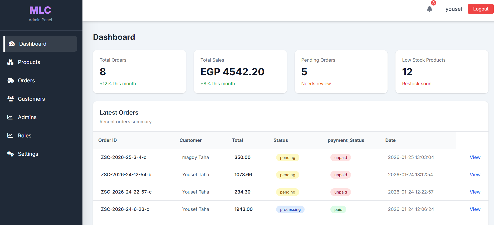

<p align="center"><a href="https://laravel.com" target="_blank"></a></p>

<p align="center">
<a href="https://github.com/laravel/framework/actions"></a>
<a href="https://packagist.org/packages/laravel/framework"></a>
<a href="https://packagist.org/packages/laravel/framework"></a>
<a href="https://packagist.org/packages/laravel/framework"></a>
</p>
## Screenshots

### Admin Dashboard


# Laravel E-Commerce System

A backend-focused e-commerce application built with Laravel 12.  
The system provides product management, order processing, and an admin dashboard.

---

## Features

- User authentication (customers & admin)
- Product management (CRUD)
- Category management
- Shopping cart
- Order creation and tracking
- Admin dashboard
- Input validation and error handling
- Authorization: roles and permissions

---

## Tech Stack

- Laravel 12
- PHP 8.3
- MySQL
- Blade templating engine
- Tailwind CSS

---

## Database Structure

Main tables used in the system:

- users
- admins
- products
- categories
- orders
- order_items
- cart
- cart_items
- wishlist
- ......

---

## Installation & Setup

Follow these steps to run the project locally:

1. Clone the repository

    ```bash
    git clone https://github.com/YoUsEfTaha364/e-commerce-app.git


    cd e-commerce-app

    composer install

    cp .env.example .env

    php artisan key:generate

    DB_CONNECTION=mysql
    DB_HOST=127.0.0.1
    DB_PORT=3306
    DB_DATABASE=your_database_name
    DB_USERNAME=your_username
    DB_PASSWORD=your_password

    php artisan migrate --seed

    php artisan serve
